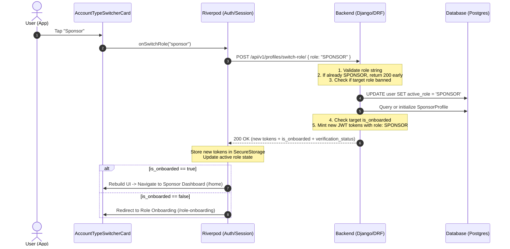

# DiasporaVest: Account Role Switch & Dual-Role Persona API Specification

This document defines the backend architecture, API contract, database schema, and operational lifecycle required to support seamless account role switching (between **Investor** and **Sponsor**) triggered by `AccountTypeSwitcherCard` in the mobile app.

---

## 1. System Architecture Overview

DiasporaVest uses a **Dual-Persona Architecture**:
- Single user authentication entity (`User` / `auth_user`).
- Independent role profiles (`InvestorProfile` and `SponsorProfile`) linked 1-to-1 to the same user.
- Switching roles changes the **active context** without requiring re-login or separate credentials.

```
                    ┌────────────────────────┐
                    │      Custom User       │
                    │   (email, password)    │
                    │   active_role: SPONSOR │
                    └───────────┬────────────┘
                                │
               ┌────────────────┴────────────────┐
               ▼                                 ▼
    ┌────────────────────┐            ┌────────────────────┐
    │  InvestorProfile   │            │   SponsorProfile   │
    │  - investor_type   │            │  - sponsor_type    │
    │  - portfolio stats │            │  - company docs    │
    │  - KYC status      │            │  - KYC status      │
    └────────────────────┘            └────────────────────┘
```

---

## 2. Database Schema Recommendations

### 2.1 User Model Extension
Add an `active_role` field to track which persona the user is currently operating in:
```python
# models.py (Django DRF Example)
from django.contrib.auth.models import AbstractUser
from django.db import models

class User(AbstractUser):
    class RoleChoices(models.TextChoices):
        INVESTOR = 'INVESTOR', 'Investor'
        SPONSOR = 'SPONSOR', 'Sponsor'

    active_role = models.CharField(
        max_length=20,
        choices=RoleChoices.choices,
        default=RoleChoices.INVESTOR,
    )
```

### 2.2 Independent Profile Models
Ensure profiles are kept separate so data never collides:
- `InvestorProfile`: Stores investor type (`INDIVIDUAL`/`COMPANY`), risk appetite, interested industries, investment history.
- `SponsorProfile`: Stores sponsor type (`INDIVIDUAL`/`COMPANY`), legal company details, verification documents, published projects.

---

## 3. API Specification

### 3.1 Switch Role Endpoint

**Endpoint:** `POST /api/v1/profiles/switch-role/`  
**Authentication:** `Authorization: Bearer <access_token>`  
**Content-Type:** `application/json`

#### Request Payload
```json
{
  "role": "SPONSOR"
}
```
*(Allowed values: `"SPONSOR"`, `"INVESTOR"`)*

#### Success Response (`200 OK`)
```json
{
  "status": "success",
  "message": "Switched to SPONSOR mode successfully.",
  "data": {
    "active_role": "SPONSOR",
    "is_onboarded": true,
    "verification_status": "APPROVED",
    "account_type": "COMPANY",
    "access": "eyJhbGciOiJIUzI1NiIsInR5cCI6IkpXVCJ9...",
    "refresh": "eyJhbGciOiJIUzI1NiIsInR5cCI6IkpXVCJ9...",
    "user": {
      "id": 42,
      "email": "user@example.com",
      "first_name": "Jane",
      "last_name": "Doe",
      "active_role": "SPONSOR"
    }
  }
}
```

#### Field Explanations:
| Field | Type | Description |
|---|---|---|
| `active_role` | `string` | The new active role (`"SPONSOR"` or `"INVESTOR"`). |
| `is_onboarded` | `boolean` | `true` if target profile onboarding is complete. `false` if target role needs onboarding. |
| `verification_status` | `string` | `"APPROVED"`, `"PENDING"`, `"REJECTED"`, `"UNVERIFIED"`, or `"NOT_SUBMITTED"`. |
| `account_type` | `string` | `"INDIVIDUAL"`, `"COMPANY"`, or `null`. |
| `access` | `string` | **Fresh JWT access token** carrying updated `role: "SPONSOR"` claim. |
| `refresh` | `string` | **Fresh JWT refresh token**. |
| `user` | `object` | Updated user summary. |

#### Error Responses

- **400 Bad Request** (Invalid role parameter):
```json
{
  "status": "error",
  "message": "Invalid role specified. Must be 'INVESTOR' or 'SPONSOR'.",
  "code": "INVALID_ROLE"
}
```

- **403 Forbidden** (Role suspended or blocked):
```json
{
  "status": "error",
  "message": "Your Sponsor account is suspended. Contact support.",
  "code": "ROLE_SUSPENDED"
}
```

---

### 3.2 Get User Roles & Status Summary (Optional Utility)

**Endpoint:** `GET /api/v1/profiles/roles-summary/`  
**Authentication:** `Authorization: Bearer <access_token>`

Returns status overview of both profiles so app can display badges or banners.

```json
{
  "status": "success",
  "data": {
    "active_role": "INVESTOR",
    "investor": {
      "is_onboarded": true,
      "verification_status": "APPROVED",
      "account_type": "INDIVIDUAL"
    },
    "sponsor": {
      "is_onboarded": false,
      "verification_status": "NOT_SUBMITTED",
      "account_type": null
    }
  }
}
```

---

## 4. End-to-End Sequence & Changes Flow



---

## 5. Backend Implementation Best Practices

### 1. Token Claims Strategy (JWT)
- **Do not rely solely on database lookups** for role checks on high-throughput endpoints.
- Encode the active role directly inside the JWT payload:
  ```json
  {
    "token_type": "access",
    "exp": 1728220800,
    "user_id": 42,
    "role": "SPONSOR"
  }
  ```
- When `switch-role` succeeds, issue a new access/refresh pair with the updated claim.

### 2. Lazy Profile Creation
- When an Investor switches to Sponsor for the first time, backend should automatically create a blank `SponsorProfile` record with `is_onboarded=False` instead of throwing a `404 Profile Not Found`.
- Return `is_onboarded: false` so the Flutter app routes the user to `RoleOnboardingView(role: 'sponsor')`.

### 3. Role-Based Permission Middleware
Ensure role-specific endpoints enforce active role checking:
```python
# permissions.py
from rest_framework.permissions import BasePermission

class IsActiveSponsor(BasePermission):
    def has_permission(self, request, view):
        return bool(
            request.user and 
            request.user.is_authenticated and 
            request.user.active_role == 'SPONSOR'
        )
```
If an Investor sends a request to `/api/v1/projects/sponsor/`, backend returns:
```json
{
  "status": "error",
  "code": "ROLE_MISMATCH",
  "message": "Sponsor role required to access this resource."
}
```

### 4. FCM Push Notification Topic Management
- If backend segments notifications by role (e.g. `sponsor_announcements` vs `investor_deals`), update device registration or send notifications targeting `user_id` with active role filtering.

---

## 6. Edge Cases & Handling

| Scenario | Risk | Backend Handling |
|---|---|---|
| **Already in Target Role** | Redundant DB writes & token minting. | Return immediate `200 OK` with current token and metadata (idempotent). |
| **First-time switch (Not Onboarded)** | App crashes trying to load nonexistent profile. | Return `is_onboarded: false`. App redirects to step-by-step role onboarding. |
| **Verification Pending / Rejected** | Sponsor attempts to create projects while unverified. | Switch succeeds, `verification_status: "PENDING"`. Allow browsing dashboard; block creation endpoints with `403 Verification Required`. |
| **Suspended Persona** | Banned Sponsor attempts to switch to Sponsor. | Return `403 Forbidden` (`ROLE_SUSPENDED`). Active role remains Investor. |
| **Token Expiry During Switch** | Expired refresh token. | Return standard `401 Unauthorized`. App prompts re-authentication. |
| **Concurrent Requests with Stale Token** | Investor token used while switch processing. | Short 30-second token grace period, or immediate invalidation if role mismatch detected. |

---

## 7. Frontend Integration Contract

Upon receiving `200 OK` from `POST /api/v1/profiles/switch-role/`:

```dart
// Flow executed in Flutter authProvider / sessionProvider:
Future<void> switchRole(String newRole) async {
  final response = await repository.switchRole(newRole);
  if (response.success) {
    await StorageService.saveToken(response.data.access);
    await StorageService.saveRefreshToken(response.data.refresh);
    await StorageService.saveRole(newRole);
    
    state = state.copyWith(userRole: newRole);

    if (!response.data.isOnboarded) {
      // Direct user to complete onboarding for new role
      AppRouter.router.go('/role-onboarding', extra: {'role': newRole});
    } else {
      // Re-trigger dashboard load for new role
      AppRouter.router.go('/home');
    }
  }
}
```
